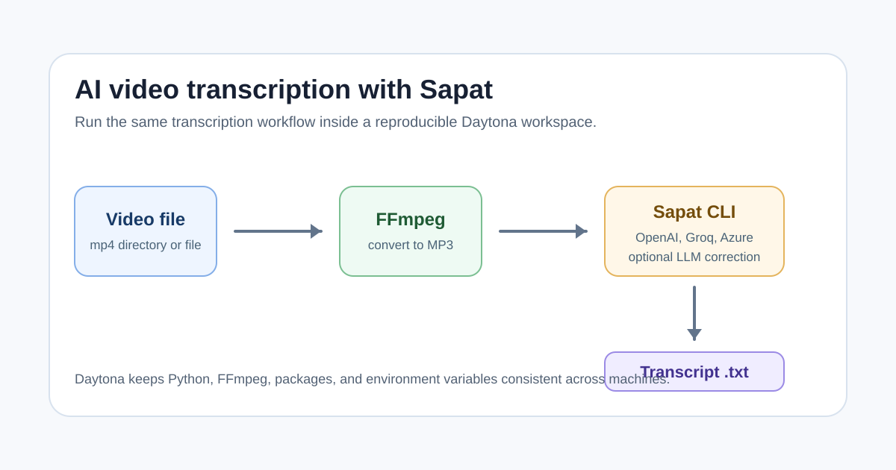

# AI Video Transcription with Sapat and Daytona

# Introduction

Video is easy to record but annoying to search. A product demo, customer call,
team update, or tutorial can contain useful details that stay trapped until
someone turns the audio into text. That is where [speech to text](../definitions/20260511_definition_speech_to_text.md)
becomes practical: a transcript lets you skim, quote, summarize, translate, and
feed the material into downstream AI workflows.

[Sapat](https://github.com/nkkko/sapat) is a small Python command line tool that
wraps that workflow. It takes a video file or a directory of `.mp4` files,
converts each file to MP3 with FFmpeg, sends the audio to a transcription API,
and writes a `.txt` transcript next to the original file. The current project
supports OpenAI, Groq, and Azure OpenAI providers, so you can choose the
transcription backend that best fits your speed, privacy, cost, and deployment
requirements.

This guide shows how to run Sapat inside a [Daytona](https://www.daytona.io/)
workspace. Daytona is useful here because audio tooling often depends on a mix
of Python packages, FFmpeg, API keys, and provider-specific environment
variables. Putting those pieces in a reproducible workspace keeps the setup
portable instead of turning it into another "works on my laptop" script.



## TL;DR

- Sapat converts video files to MP3 with FFmpeg, transcribes the audio through
  OpenAI, Groq, or Azure OpenAI, then saves the transcript as a `.txt` file.
- Daytona gives you a clean workspace for Python, FFmpeg, secrets, and repeatable
  CLI usage.
- Use `--api openai`, `--api groq`, or `--api azure` to choose a provider.
- Start with one short video, verify the `.txt` output, then process a directory
  when the provider configuration is correct.
- Keep API keys in `.env`, avoid committing transcripts that contain private
  information, and watch file size limits before sending audio to a provider.

## Prerequisites

You need the following before starting:

- A Daytona installation. See the [Daytona CLI documentation](https://www.daytona.io/docs/en/tools/cli/)
  if you are setting it up for the first time.
- Docker or another configured Daytona target that can run a Python workspace.
- A GitHub account that can clone the Sapat repository.
- An API key for at least one supported provider: OpenAI, Groq, or Azure OpenAI.
- A short `.mp4` test video. Use a non-sensitive recording while you validate
  your setup.

Sapat currently targets Python 3.6 or later, but the included dev container uses
Python 3.12. The project also expects FFmpeg to be installed because the CLI
extracts audio from the video before sending the request to the provider.

## Step 1: Create a Daytona Workspace

Create a workspace directly from the Sapat repository:

```bash
daytona create https://github.com/nkkko/sapat --code
```

Open the workspace in your preferred editor. The repository includes a
`.devcontainer/devcontainer.json` file that installs FFmpeg and Python
requirements during workspace creation:

```json
{
  "postCreateCommand": {
    "ffmpeg": "sudo apt install ffmpeg -y",
    "requirements": "pip install -r requirements.txt"
  }
}
```

If you are using a workspace that does not run the dev container commands
automatically, install the requirements manually:

```bash
sudo apt update
sudo apt install ffmpeg -y
python -m pip install -e .
```

The editable install is convenient while you are learning the project because it
registers the `sapat` command from `pyproject.toml` without requiring you to
build a wheel first.

## Step 2: Check the CLI

Run the help command before adding API credentials:

```bash
sapat --help
```

You should see options similar to this:

```text
Usage: sapat [OPTIONS] INPUT_PATH

Options:
  -l, --language TEXT            Language of the audio (default: en)
  -p, --prompt TEXT              Optional prompt to guide the model
  -t, --temperature FLOAT        Sampling temperature (default: 0.3)
  -q, --quality [l|m|h]          Quality of the MP3 audio
  --correct                      Use LLM to correct the transcript
  -a, --api [openai|groq|azure]  API to use for the transcription
  --help                         Show this message and exit.
```

This confirms that Python can import the package and that the console entry
point is available in your workspace.

## Step 3: Configure Environment Variables

Copy the example environment file:

```bash
cp .env.example .env
```

Then fill only the provider you want to use first.

For OpenAI:

```bash
OPENAI_API_KEY=your_openai_api_key_here
OPENAI_MODEL=whisper-1
OPENAI_API_ENDPOINT=https://api.openai.com/v1/audio/transcriptions
OPENAI_MODEL_NAME_CHAT=gpt-4o
```

The Sapat README uses `whisper-1`, which is still a common baseline for
transcription workflows. The current OpenAI speech-to-text guide also lists
newer transcription models such as `gpt-4o-transcribe`,
`gpt-4o-mini-transcribe`, and `gpt-4o-transcribe-diarize`; check the
[OpenAI speech-to-text documentation](https://platform.openai.com/docs/guides/speech-to-text)
before changing models because response formats and parameter support differ by
model.

For Groq:

```bash
GROQCLOUD_API_KEY=your_groq_api_key_here
GROQCLOUD_MODEL=whisper-large-v3-turbo
GROQCLOUD_API_ENDPOINT=https://api.groq.com/openai/v1/audio/transcriptions
GROQCLOUD_MODEL_NAME_CHAT=llama3-8b-8192
```

Groq's speech-to-text API uses an OpenAI-compatible endpoint and supports models
such as `whisper-large-v3` and `whisper-large-v3-turbo`. The
[Groq speech-to-text documentation](https://console.groq.com/docs/speech-to-text)
is useful when deciding between speed, accuracy, and response formats.

For Azure OpenAI:

```bash
AZURE_OPENAI_API_KEY=your_azure_api_key_here
AZURE_OPENAI_ENDPOINT=https://DEPLOYMENTENDPOINTNAME.openai.azure.com
AZURE_OPENAI_DEPLOYMENT_NAME_WHISPER=whisper
AZURE_OPENAI_API_VERSION_WHISPER=2024-06-01
AZURE_OPENAI_DEPLOYMENT_NAME_CHAT=gpt-4o
AZURE_OPENAI_API_VERSION_CHAT=2023-03-15-preview
```

Do not commit `.env`. Keep provider credentials in Daytona workspace secrets,
your local environment, or another secret manager when you move beyond a test
workspace.

## Step 4: Transcribe One Video

Put a short test video in the repository, for example:

```bash
mkdir -p samples
cp ~/Downloads/demo-call.mp4 samples/demo-call.mp4
```

Run Sapat with OpenAI:

```bash
sapat samples/demo-call.mp4 --api openai --language en --quality M
```

Run the same file with Groq:

```bash
sapat samples/demo-call.mp4 --api groq --language en --quality M
```

Run it with Azure OpenAI:

```bash
sapat samples/demo-call.mp4 --api azure --language en --quality M
```

Sapat writes the transcript beside the source video:

```text
samples/demo-call.txt
```

Under the hood, Sapat converts `samples/demo-call.mp4` to
`samples/demo-call.mp3`, uploads the MP3 file to the selected provider, writes
the text result, and removes the temporary MP3 file.

## Step 5: Choose the Right Audio Quality

The `--quality` option controls the MP3 conversion settings before upload:

| Option | FFmpeg shape | When to use it |
| --- | --- | --- |
| `L` | 22050 Hz, mono, 96 kbps | Quick drafts, small files, mostly speech |
| `M` | 44100 Hz, mono, 96 kbps | Default choice for normal meetings and demos |
| `H` | 44100 Hz, stereo, 192 kbps | Higher quality source audio or noisy recordings |

Start with `M`. If the provider rejects the file for size, try `L`, trim the
video, or split a long recording into smaller segments. If the transcript misses
words because of background noise, try `H` and compare the result.

## Step 6: Add Prompt Context

Speech models often perform better when they receive domain vocabulary. Sapat's
`--prompt` flag passes context to the transcription request:

```bash
sapat samples/demo-call.mp4 \
  --api openai \
  --language en \
  --prompt "Product names: Daytona, Sapat, Groq, Azure OpenAI. Speaker mentions dev containers and FFmpeg." \
  --quality M
```

Use the prompt for proper nouns, acronyms, product names, customer names, or
technical words that are easy to mishear. Keep it short. The prompt is context,
not a summary request.

## Step 7: Process a Directory

After one file works, process a folder:

```bash
sapat samples --api groq --language en --quality M
```

The current CLI scans the directory for `.mp4` files. A simple workflow is:

1. Put raw videos in `samples/raw`.
2. Run Sapat on that directory.
3. Move generated `.txt` files to `transcripts`.
4. Review transcripts before sharing or sending them into another AI workflow.

For example:

```bash
mkdir -p transcripts
sapat samples/raw --api groq --language en --quality M
mv samples/raw/*.txt transcripts/
```

Review the transcripts before committing them. Recordings can contain names,
credentials, customer data, or internal decisions that should not live in a
public repository.

## Step 8: Use Transcript Correction Carefully

Sapat also includes a `--correct` option. This makes an additional chat model
call to clean up spelling and punctuation after the raw transcript is produced:

```bash
sapat samples/demo-call.mp4 \
  --api openai \
  --language en \
  --quality M \
  --correct
```

This is useful for polishing a transcript that will become release notes, a blog
draft, or searchable documentation. It is not a replacement for review. Keep the
raw transcript if you need an audit trail, and compare the corrected version for
meaning changes before publishing.

When following the current Sapat implementation, start correction with the
OpenAI or Groq provider path. If you adapt the Azure path, make sure the
provider's `generate_corrected_transcript` method uses the same argument order
as the base workflow.

## Provider Selection Guide

Each provider is useful in a different situation:

| Provider | Best fit | Notes |
| --- | --- | --- |
| OpenAI | General-purpose transcription and newer speech-to-text models | The OpenAI docs list `whisper-1` plus newer `gpt-4o` transcription models. |
| Groq | Fast and cost-sensitive batch transcription | Groq's docs describe `whisper-large-v3-turbo` as the speed-oriented choice. |
| Azure OpenAI | Teams already using Azure identity, networking, and deployments | Requires Azure deployment names and API versions, not just a model string. |

The nice part is that Sapat keeps the CLI shape the same. You can switch
providers with `--api` while leaving most of the workflow unchanged.

## Extending Sapat with Another Provider

Sapat is small enough to understand quickly. Provider implementations live in
`src/sapat/transcription/` and inherit from `TranscriptionBase`.

A new provider usually needs three changes:

1. Add a provider class in `src/sapat/transcription/new_provider.py`.
2. Implement `transcribe_audio(self, audio_file: str, **kwargs)`.
3. Register the provider in `src/sapat/script.py` so the `--api` option can
   select it.

A simplified provider skeleton looks like this:

```python
import os
import requests
from dotenv import load_dotenv
from .base import TranscriptionBase

load_dotenv(".env")

class ExampleTranscription(TranscriptionBase):
    def __init__(self, temperature: float, response_format: str = "json"):
        self.api_key = os.getenv("EXAMPLE_API_KEY")
        self.endpoint = os.getenv("EXAMPLE_API_ENDPOINT")
        self.model = os.getenv("EXAMPLE_MODEL")
        self.temperature = temperature
        self.response_format = response_format

    def transcribe_audio(self, audio_file: str, **kwargs):
        data = {
            "model": kwargs.get("model", self.model),
            "response_format": kwargs.get("response_format", self.response_format),
            "temperature": kwargs.get("temperature", self.temperature),
        }

        with open(audio_file, "rb") as audio:
            response = requests.post(
                self.endpoint,
                headers={"Authorization": f"Bearer {self.api_key}"},
                data=data,
                files={"file": audio},
                timeout=120,
            )

        response.raise_for_status()
        return response.json()
```

If you add a provider, keep the environment variable names explicit, document
file size limits, and add a small fixture or mocked test around request
construction. Most transcription failures are configuration issues, so clear
errors are as important as the API call itself.

## Common Issues and Troubleshooting

**Problem:** `sapat: command not found`

**Solution:** Install the project in the active Python environment:

```bash
python -m pip install -e .
```

Then reopen the terminal or make sure your virtual environment is activated.

**Problem:** FFmpeg is missing.

**Solution:** Install FFmpeg in the workspace:

```bash
sudo apt update
sudo apt install ffmpeg -y
```

Then verify it:

```bash
ffmpeg -version
```

**Problem:** The provider returns an authentication error.

**Solution:** Check the relevant API key in `.env`, confirm that the variable
name matches Sapat's expected name, and restart the shell so environment changes
are loaded.

**Problem:** The API rejects the upload.

**Solution:** Check provider file size and format limits. OpenAI's speech-to-text
docs list supported upload formats and a 25 MB file limit for the Audio API.
Groq documents direct upload limits by tier and supports common audio and video
containers through its speech-to-text endpoint. If a video is too large, lower
the `--quality`, trim the recording, or split it into chunks before running
Sapat.

**Problem:** The transcript has incorrect product names.

**Solution:** Add a focused `--prompt` with the names and acronyms that matter.
Do not overload the prompt with a full meeting agenda. Short vocabulary hints
usually work better than a paragraph of instructions.

**Problem:** The transcript exists but should not be public.

**Solution:** Add transcripts and raw recordings to `.gitignore` if your
workspace is connected to a public repository:

```gitignore
samples/
transcripts/
*.mp4
*.mp3
*.txt
```

Use a narrower ignore pattern if your project already tracks text files.

## Conclusion

Sapat gives you a practical video transcription pipeline without hiding the
moving parts. FFmpeg handles audio extraction, provider classes handle
transcription APIs, and the CLI gives you one command for a file or a directory.
Running it inside Daytona makes the workflow easier to reproduce because the
workspace can carry the same Python setup, FFmpeg installation, and environment
shape across machines.

Start small: transcribe one short, non-sensitive video with one provider. Once
that works, add prompts, compare providers, and batch a directory. From there,
you can extend Sapat with another transcription backend or connect the generated
text files to summarization, search, documentation, or support workflows.

## References

- [Sapat GitHub repository](https://github.com/nkkko/sapat)
- [Daytona CLI documentation](https://www.daytona.io/docs/en/tools/cli/)
- [OpenAI speech-to-text documentation](https://platform.openai.com/docs/guides/speech-to-text)
- [Groq speech-to-text documentation](https://console.groq.com/docs/speech-to-text)
- [FFmpeg documentation](https://ffmpeg.org/documentation.html)
